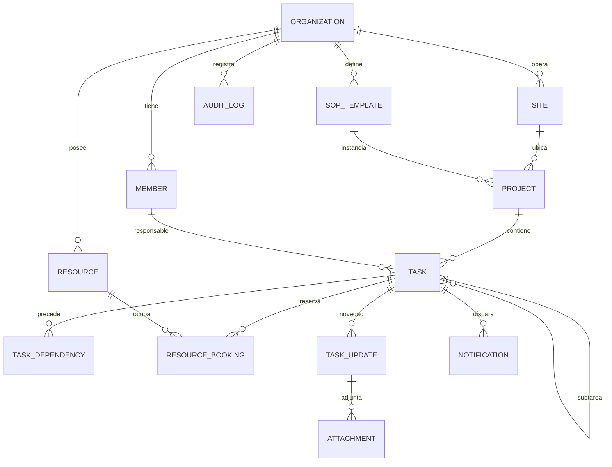
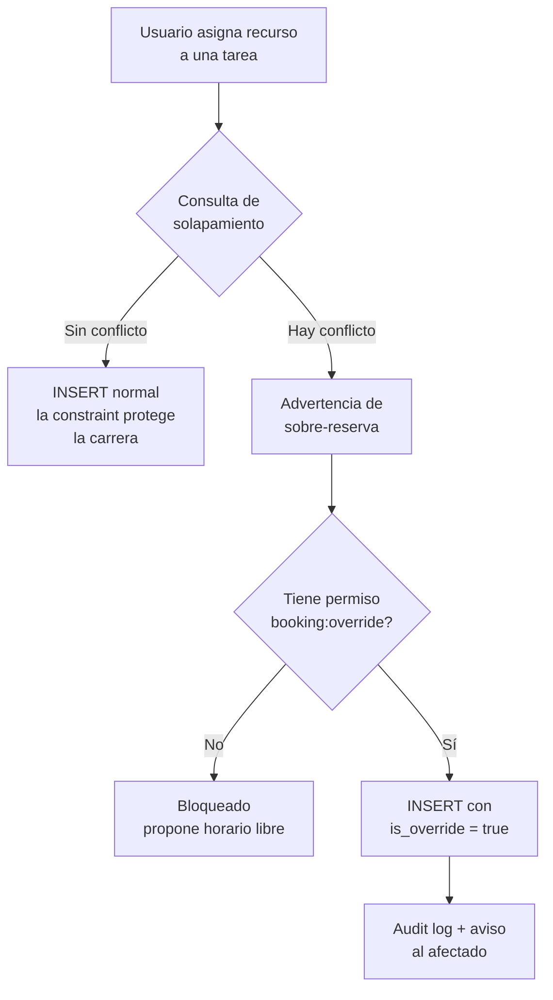

# Modelo de Datos y Persistencia

## App de Orquestación Digital de Procesos (SaaS Multi-Tenant)

2026-09-18 · @Someone

## Alcance y convenciones transversales

Este documento fija el esquema de PostgreSQL 17 que implementa los requerimientos RF-A1 a RF-F3, con Drizzle como ORM. Todo lo que está acá es decisión cerrada salvo lo listado en la última sección.

Siete convenciones aplican a todas las tablas de negocio:

| Convención | Decisión | Motivo |
| --- | --- | --- |
| Clave primaria | `uuid` con UUIDv7 generado en el cliente | El móvil offline crea filas sin esperar al servidor. UUIDv7 es ordenable por tiempo, así que el índice B-tree no se fragmenta como con v4. |
| Tenant | `organization_id uuid NOT NULL` en toda tabla, incluso las hijas | Es lo que habilita RLS y los índices compuestos. La redundancia es deliberada. |
| Claves foráneas | Compuestas `(organization_id, <id>)` | Hace estructuralmente imposible referenciar una fila de otro tenant. |
| Tiempos | `timestamptz` en UTC, siempre | La zona horaria vive en `organization` y `site`, no en las filas. |
| Borrado | `deleted_at timestamptz NULL` | El audit trail y la sincronización necesitan que la fila siga existiendo. |
| Concurrencia | `version integer NOT NULL DEFAULT 1`, incrementado por trigger | Base de la resolución de conflictos de sincronización offline. |
| Orden manual | `position text` con indexación fraccionaria (`a0`, `a0m`, `a1`) | Reordenar offline no renumera filas vecinas, así que no genera conflictos. |

Columnas estándar en toda tabla: `id`, `organization_id`, `created_at`, `updated_at`, `deleted_at`, `version`, `created_by_member_id`.

Estados cerrados (`status`, `criticality`, `kind`) se modelan como `text` con `CHECK`, no como enums nativos de Postgres. Agregar un valor a un enum nativo bloquea y no se puede revertir dentro de una transacción; un `CHECK` se reemplaza con `ALTER TABLE ... VALIDATE` sin downtime. Lo que el tenant configura va en tablas de catálogo.

Extensiones requeridas: `btree_gist` (reservas), `pg_trgm` (búsqueda de texto), `pgcrypto` (hash de tokens de invitado). `ltree` si se confirma el árbol de subtareas de profundidad libre.

Nombres en `snake_case`, tablas en plural. Drizzle expone los nombres en `camelCase` del lado TypeScript, así que la convención de base no contamina el código de aplicación.

## Diagrama entidad-relación

Trece entidades forman el núcleo. Las auxiliares (definiciones de campos, enlaces de invitado, planes, preferencias de notificación) aparecen en sus secciones.



La lectura clave: `ORGANIZATION` es la raíz de todo y ninguna entidad existe fuera de ella, `TASK` se referencia a sí misma para las subtareas, y `RESOURCE_BOOKING` es la tabla intermedia donde vive la prevención de sobre-reserva.

Los cinco módulos del monolito modular mapean así:

| Módulo NestJS | Tablas que posee |
| --- | --- |
| `tenancy` | organization, member, site, member\_site\_access, guest\_link, plan, subscription |
| `projects` | project, task, task\_dependency, sop\_template, sop\_template\_task, custom\_field\_definition |
| `scheduling` | resource, resource\_group, resource\_booking |
| `collaboration` | task\_update, attachment, task\_acknowledgement |
| `notifications` | notification, notification\_preference, escalation\_policy |

`audit_log` es transversal: lo escriben triggers, no módulos. Ningún módulo consulta tablas de otro; se comunican por eventos in-process y por identificadores.

## Identidad, tenancy y RBAC

Better Auth aporta `user`, `session`, `account`, `verification`, `organization`, `member` e `invitation`. Esas tablas no se modifican: se extienden con tablas propias unidas por clave foránea, para que las migraciones del CLI de Better Auth nunca pisen lógica de negocio.

`organization` es el tenant. Su perfil operativo va aparte:

```sql
CREATE TABLE organization_profile (
  organization_id  uuid PRIMARY KEY REFERENCES organization(id) ON DELETE CASCADE,
  legal_name       text,
  tax_id           text,
  industry         text NOT NULL CHECK (industry IN
                     ('gastronomia','agro','salud','mineria','energia',
                      'construccion','eventos','otro')),
  timezone         text NOT NULL DEFAULT 'America/Argentina/Buenos_Aires',
  locale           text NOT NULL DEFAULT 'es-AR',
  created_at       timestamptz NOT NULL DEFAULT now()
);
```

`industry` no cambia el esquema: solo decide qué plantillas SOP y qué campos personalizados se siembran al crear la cuenta.

### Los cuatro niveles

Los niveles 1 a 3 del documento de requerimientos son roles de Better Auth sobre `member`. El nivel 4 no lo es.

| Nivel | Rol | Alcance |
| --- | --- | --- |
| 1 Directivo | `owner`, `director` | Toda la organización |
| 2 Gerencia media | `manager` | Solo los sitios asignados |
| 3 Operativo | `operator` | Solo sus tareas y las de su sitio |
| 4 Invitado | no es `member` | Un enlace firmado, sin cuenta |

### Alcance por sitio

El documento original define el RBAC como cuatro niveles planos. Eso no alcanza en cuanto una organización tiene dos locales o dos frentes de obra: un encargado manda en el Local A y no debe ver el B. Por eso el rol se combina con un alcance:

```sql
CREATE TABLE site (
  id               uuid PRIMARY KEY,
  organization_id  uuid NOT NULL REFERENCES organization(id),
  name             text NOT NULL,
  timezone         text NOT NULL,
  address          text,
  geo              point,
  is_active        boolean NOT NULL DEFAULT true,
  UNIQUE (organization_id, id)
);

CREATE TABLE member_site_access (
  organization_id  uuid NOT NULL,
  member_id        uuid NOT NULL,
  site_id          uuid NOT NULL,
  role             text NOT NULL CHECK (role IN ('manager','operator')),
  PRIMARY KEY (member_id, site_id),
  FOREIGN KEY (organization_id, site_id) REFERENCES site (organization_id, id)
);
```

Un `owner` o `director` no necesita filas acá: ve todos los sitios. La ausencia de filas para un `manager` significa que todavía no tiene nada asignado, no que ve todo.

Los permisos concretos (`task:create`, `booking:override`, `project:archive`) se definen en código como un mapa de rol a capacidades, no en la base. Cambiar un permiso debe ser un deploy revisable, no un `UPDATE`.

### Invitados

Un invitado del nivel 4 nunca es usuario. Recibe una URL con un token cuyo hash se guarda:

```sql
CREATE TABLE guest_link (
  id               uuid PRIMARY KEY,
  organization_id  uuid NOT NULL,
  token_hash       bytea NOT NULL UNIQUE,
  scope_kind       text NOT NULL CHECK (scope_kind IN ('project','task','milestones')),
  scope_id         uuid NOT NULL,
  label            text,
  expires_at       timestamptz NOT NULL,
  revoked_at       timestamptz,
  last_viewed_at   timestamptz,
  view_count       integer NOT NULL DEFAULT 0,
  created_by_member_id uuid NOT NULL
);
```

El token en claro solo existe en el momento de generarlo y en el enlace que recibe el destinatario. El endpoint que lo consume devuelve una proyección de solo lectura, nunca las entidades completas. Esto importa especialmente en el caso de salud, donde el invitado es un familiar y la fuga de un campo de más es un problema regulatorio.

## Proyectos, plantillas y tareas

`project` es el agrupador de alto nivel (proyecto, operación o caso, según el sector). `task` es la unidad de trabajo y se referencia a sí misma para las subtareas.

```sql
CREATE TABLE project (
  id               uuid PRIMARY KEY,
  organization_id  uuid NOT NULL,
  site_id          uuid,
  sop_template_id  uuid,
  code             text NOT NULL,
  name             text NOT NULL,
  description      text,
  status           text NOT NULL DEFAULT 'planning'
                     CHECK (status IN ('planning','active','on_hold','archived')),
  starts_at        timestamptz,
  ends_at          timestamptz,
  archived_at      timestamptz,
  custom_fields    jsonb NOT NULL DEFAULT '{}',
  UNIQUE (organization_id, code),
  UNIQUE (organization_id, id),
  FOREIGN KEY (organization_id, site_id) REFERENCES site (organization_id, id)
);
```

`archived_at` implementa RF-F1: el proyecto pasa a histórico de solo lectura. La regla no es un trigger sino un guard de aplicación, porque los trabajos de fondo sí necesitan escribir sobre proyectos archivados (por ejemplo, terminar de subir una foto que se sincronizó tarde).

### Tareas

```sql
CREATE TABLE task (
  id                  uuid PRIMARY KEY,
  organization_id     uuid NOT NULL,
  project_id          uuid NOT NULL,
  parent_task_id      uuid,
  path                ltree NOT NULL,
  title               text NOT NULL,
  description         text,
  status              text NOT NULL DEFAULT 'pending' CHECK (status IN
                        ('pending','in_progress','blocked','in_review','done','cancelled')),
  criticality         text NOT NULL DEFAULT 'normal' CHECK (criticality IN
                        ('low','normal','high','critical')),
  assignee_member_id  uuid,
  planned_start_at    timestamptz,
  planned_end_at      timestamptz,
  actual_start_at     timestamptz,
  actual_end_at       timestamptz,
  is_milestone        boolean NOT NULL DEFAULT false,
  ack_required        boolean NOT NULL DEFAULT false,
  position            text NOT NULL,
  custom_fields       jsonb NOT NULL DEFAULT '{}',
  version             integer NOT NULL DEFAULT 1,
  UNIQUE (organization_id, id),
  FOREIGN KEY (organization_id, project_id) REFERENCES project (organization_id, id),
  FOREIGN KEY (organization_id, parent_task_id) REFERENCES task (organization_id, id),
  CONSTRAINT dates_coherent CHECK (planned_end_at IS NULL OR planned_start_at IS NULL
                                   OR planned_end_at >= planned_start_at)
);

CREATE INDEX task_path_idx ON task USING gist (path);
```

La columna `path` (`ltree`) guarda la ruta desde la raíz. Con `parent_task_id` solo, traer un subárbol completo exige un CTE recursivo por cada consulta; con `ltree` es `WHERE path <@ 'raiz.rama'`, que resuelve en un índice. El costo es mantener `path` en un trigger al insertar o mover. Si se decide limitar la jerarquía a dos niveles, `ltree` sobra y se puede quitar.

Los cinco estados de RF-E1 están más `cancelled`, que el documento original no contempla y que aparece siempre: una cirugía se suspende, una cosecha se cancela por lluvia. Sin ese estado los KPIs de cumplimiento quedan contaminados.

Las transiciones válidas se validan en la capa de aplicación con una máquina de estados explícita, no con un trigger. Un trigger que rechaza una transición produce un error de base opaco a 200 km del frente de obra; un guard de aplicación devuelve un mensaje que el operario entiende.

### Plantillas SOP

Una plantilla es un árbol de tareas con tiempos relativos, no fechas:

```sql
CREATE TABLE sop_template (
  id               uuid PRIMARY KEY,
  organization_id  uuid NOT NULL,
  name             text NOT NULL,
  industry_hint    text,
  is_active        boolean NOT NULL DEFAULT true,
  UNIQUE (organization_id, id)
);

CREATE TABLE sop_template_task (
  id                     uuid PRIMARY KEY,
  organization_id        uuid NOT NULL,
  sop_template_id        uuid NOT NULL,
  parent_id              uuid,
  title                  text NOT NULL,
  offset_start_minutes   integer NOT NULL DEFAULT 0,
  duration_minutes       integer NOT NULL DEFAULT 60,
  default_role           text,
  criticality            text NOT NULL DEFAULT 'normal',
  is_milestone           boolean NOT NULL DEFAULT false,
  position               text NOT NULL,
  custom_fields_defaults jsonb NOT NULL DEFAULT '{}'
);
```

`offset_start_minutes` se cuenta desde el inicio del proyecto. Instanciar una plantilla es copiar el árbol resolviendo cada offset contra la fecha de inicio real, en la zona horaria del sitio. Un protocolo pre-quirúrgico que arranca 90 minutos antes de la incisión usa offsets negativos.

`default_role` asigna por rol, no por persona: al instanciar, el sistema propone al miembro con ese rol en el sitio. La asignación nominal queda siempre bajo control humano.

## Campos personalizados

RF-A5 se implementa con una columna `jsonb` en `task` y `project`, más una tabla de definiciones por tenant. No con EAV.

```sql
CREATE TABLE custom_field_definition (
  id               uuid PRIMARY KEY,
  organization_id  uuid NOT NULL,
  scope            text NOT NULL CHECK (scope IN ('project','task')),
  project_id       uuid,
  key              text NOT NULL CHECK (key ~ '^[a-z][a-z0-9_]{0,38}$'),
  label            text NOT NULL,
  type             text NOT NULL CHECK (type IN
                     ('text','number','boolean','date','datetime','select',
                      'multiselect','photo','signature')),
  config           jsonb NOT NULL DEFAULT '{}',
  is_required      boolean NOT NULL DEFAULT false,
  position         text NOT NULL,
  UNIQUE (organization_id, scope, project_id, key)
);

CREATE INDEX task_custom_fields_idx
  ON task USING gin (custom_fields jsonb_path_ops);
```

`project_id` nulo significa que el campo aplica a toda la organización; con valor, solo a ese proyecto. `config` guarda lo específico del tipo: opciones de un `select`, mínimo y máximo de un `number`, unidad a mostrar.

Por qué no EAV: con una tabla `entity_attribute_value`, traer 50 tareas con 8 campos cada una son 400 filas y un pivot en la aplicación, y la sincronización offline tendría que replicar esa tabla y rearmar el pivot en SQLite. Con `jsonb`, el campo viaja dentro de la fila de la tarea, que es exactamente lo que PowerSync sincroniza.

La validación se genera desde la definición: el backend arma un esquema Zod a partir de las filas de `custom_field_definition` y lo cachea por organización, invalidando cuando cambia. El mismo esquema se serializa al cliente para validar el formulario antes de guardar, así el operativo ve el error sin conexión.

Para un campo que se filtra mucho (por ejemplo, "número de lote" en agro) se agrega un índice de expresión puntual:

```sql
CREATE INDEX task_lote_idx ON task ((custom_fields->>'numero_lote'))
  WHERE custom_fields ? 'numero_lote';
```

Eso es una optimización posterior, guiada por consultas lentas reales, no algo a hacer de entrada.

## Recursos físicos y reservas

Esta es la parte más delicada del esquema. RF-B3 pide detectar el traslape, advertir y permitir forzar. La detección se resuelve en el motor con una exclusion constraint, no con un lock distribuido.

```sql
CREATE EXTENSION IF NOT EXISTS btree_gist;

CREATE TABLE resource (
  id               uuid PRIMARY KEY,
  organization_id  uuid NOT NULL,
  site_id          uuid,
  name             text NOT NULL,
  category         text NOT NULL,
  identifier       text,
  is_active        boolean NOT NULL DEFAULT true,
  custom_fields    jsonb NOT NULL DEFAULT '{}',
  UNIQUE (organization_id, id)
);

CREATE TABLE resource_booking (
  id                      uuid PRIMARY KEY,
  organization_id         uuid NOT NULL,
  resource_id             uuid NOT NULL,
  task_id                 uuid,
  kind                    text NOT NULL DEFAULT 'task'
                            CHECK (kind IN ('task','maintenance','reserved')),
  period                  tstzrange NOT NULL,
  status                  text NOT NULL DEFAULT 'confirmed'
                            CHECK (status IN ('tentative','confirmed','cancelled')),
  is_override             boolean NOT NULL DEFAULT false,
  override_reason         text,
  override_by_member_id   uuid,
  overridden_booking_ids  uuid[] NOT NULL DEFAULT '{}',
  created_by_member_id    uuid NOT NULL,
  created_at              timestamptz NOT NULL DEFAULT now(),

  FOREIGN KEY (organization_id, resource_id) REFERENCES resource (organization_id, id),
  FOREIGN KEY (organization_id, task_id)     REFERENCES task (organization_id, id),
  CONSTRAINT period_valid CHECK (lower(period) < upper(period)),
  CONSTRAINT override_justified CHECK (NOT is_override OR override_by_member_id IS NOT NULL),

  CONSTRAINT resource_no_overlap EXCLUDE USING gist (
    organization_id WITH =,
    resource_id     WITH =,
    period          WITH &&
  ) WHERE (NOT is_override AND status <> 'cancelled')
);
```

### El flujo de conflicto



La consulta previa sirve para mostrar la advertencia con los datos del conflicto. La integridad la garantiza la constraint: si dos personas confirman a la vez el mismo quirófano, la segunda transacción falla con `exclusion_violation` y la aplicación la traduce en la misma advertencia. No hay ventana de carrera, y tampoco hay un TTL de Redis que pueda expirar en el momento equivocado.

El forzado no rompe la constraint: la evita, porque el predicado `WHERE` la excluye. Eso es intencional. `overridden_booking_ids` deja registrado a qué reservas pisó, que es lo que después permite avisar al afectado y auditar la decisión.

### Tres decisiones que vienen con esto

**Mantenimiento y bloqueos son reservas.** Un tractor en service es una fila con `kind = 'maintenance'` y sin `task_id`. Así la detección de conflicto es una sola consulta contra una sola tabla.

**Cada unidad física es un recurso.** Si hay tres camionetas iguales, son tres filas de `resource`, agrupadas por `category`, no un recurso con capacidad 3. Modelar capacidad rompería la exclusion constraint y obligaría a contar en la aplicación, que es donde vuelven las condiciones de carrera. La contrapartida es que el usuario elige unidad; se compensa con un botón de asignación automática que toma la primera libre.

**Las reservas creadas sin conexión entran como `tentative`.** El móvil offline no puede verificar disponibilidad global. Al sincronizar, el servidor intenta confirmarlas: si pasan la constraint, quedan `confirmed`; si no, quedan `tentative` con un conflicto que el encargado resuelve. El operativo ve claramente que su reserva está pendiente de confirmación, nunca una falsa certeza.

## Dependencias, hitos y reprogramación

```sql
CREATE TABLE task_dependency (
  organization_id       uuid NOT NULL,
  predecessor_task_id   uuid NOT NULL,
  successor_task_id     uuid NOT NULL,
  type                  text NOT NULL DEFAULT 'FS'
                          CHECK (type IN ('FS','SS','FF','SF')),
  lag_minutes           integer NOT NULL DEFAULT 0,
  created_at            timestamptz NOT NULL DEFAULT now(),
  PRIMARY KEY (predecessor_task_id, successor_task_id),
  CHECK (predecessor_task_id <> successor_task_id),
  FOREIGN KEY (organization_id, predecessor_task_id) REFERENCES task (organization_id, id),
  FOREIGN KEY (organization_id, successor_task_id)   REFERENCES task (organization_id, id)
);
```

Los cuatro tipos son los estándar de planificación: `FS` (fin a inicio, el caso de RF-A4), `SS`, `FF`, `SF`. Empezar solo con `FS` es válido; tener la columna desde el día uno evita una migración cuando aparezca el resto.

### Prevención de ciclos

Una dependencia circular deja el cronograma sin solución y cuelga cualquier cálculo de cascada. Se valida antes de insertar:

```sql
WITH RECURSIVE reachable AS (
  SELECT successor_task_id AS id
    FROM task_dependency
   WHERE predecessor_task_id = $new_successor
  UNION
  SELECT d.successor_task_id
    FROM task_dependency d
    JOIN reachable r ON d.predecessor_task_id = r.id
)
SELECT EXISTS (SELECT 1 FROM reachable WHERE id = $new_predecessor);
```

Si devuelve `true`, la dependencia cerraría un ciclo y se rechaza. Conviene envolverlo en una función y llamarla desde un trigger `BEFORE INSERT`, porque acá sí un error de base es preferible a un cronograma corrupto.

### Reprogramación en cascada

RF-E3 se implementa en tres pasos, no como un `UPDATE` masivo:

1. **Cálculo.** Orden topológico del subgrafo afectado y propagación del desplazamiento respetando `type` y `lag_minutes`, en memoria. Las tareas `done` no se mueven; las `in_progress` se marcan como requiriendo decisión manual.
2. **Previsualización.** Se devuelve un diff (tarea, fecha actual, fecha propuesta, responsable afectado) para que el nivel 1 o 2 apruebe. Nunca se desplaza el cronograma de decenas de personas sin que alguien lo vea.
3. **Aplicación.** Todos los `UPDATE` en una transacción, más un registro en `schedule_change` que agrupa el lote para poder revertirlo.

```sql
CREATE TABLE schedule_change (
  id                  uuid PRIMARY KEY,
  organization_id     uuid NOT NULL,
  project_id          uuid NOT NULL,
  trigger_task_id     uuid,
  reason              text,
  shift_minutes       integer,
  applied_by_member_id uuid NOT NULL,
  applied_at          timestamptz NOT NULL DEFAULT now(),
  affected            jsonb NOT NULL
);
```

`affected` guarda el diff completo aplicado. Revertir es releerlo y restaurar las fechas anteriores, siempre que nadie las haya tocado después (se compara `version`).

El desplazamiento de tareas con recursos reservados debe mover también sus filas de `resource_booking`, y ahí la exclusion constraint puede rechazar el movimiento. Ese rechazo es parte del diff: la previsualización muestra "esta tarea no se puede mover al martes porque el Camión Pluma está tomado" antes de aplicar nada.

### Hitos

Un hito es `task` con `is_milestone = true` y `planned_start_at = planned_end_at`. No se le asignan subtareas ni recursos. Sirve como ancla de dependencias y como la unidad que ve el invitado del nivel 4, que no debería ver tareas operativas sino el estado de los hitos.

La ruta crítica queda fuera de la v1. Se calcula sobre este mismo modelo cuando haga falta, sin cambios de esquema.

## Novedades, adjuntos y audit trail

Son dos cosas distintas que suelen confundirse. `task_update` es lo que la gente escribe (RF-E2). `audit_log` es lo que el sistema registra solo (RF-E4). La primera se edita y se borra; la segunda no se toca nunca.

```sql
CREATE TABLE task_update (
  id                uuid PRIMARY KEY,
  organization_id   uuid NOT NULL,
  task_id           uuid NOT NULL,
  author_member_id  uuid,
  kind              text NOT NULL CHECK (kind IN
                      ('comment','status_change','block_report','evidence','system')),
  body              text,
  metadata          jsonb NOT NULL DEFAULT '{}',
  client_mutation_id uuid UNIQUE,
  created_at        timestamptz NOT NULL DEFAULT now(),
  edited_at         timestamptz,
  deleted_at        timestamptz,
  FOREIGN KEY (organization_id, task_id) REFERENCES task (organization_id, id)
);
```

`client_mutation_id` es la clave de idempotencia de la sincronización offline: el móvil lo genera al crear la novedad, y si reintenta el envío tras perder señal, el `UNIQUE` evita el duplicado sin lógica extra.

`author_member_id` es nulable para las entradas de tipo `system` ("la tarea se reprogramó por cascada").

### Adjuntos

```sql
CREATE TABLE attachment (
  id               uuid PRIMARY KEY,
  organization_id  uuid NOT NULL,
  task_update_id   uuid,
  task_id          uuid,
  storage_key      text NOT NULL,
  mime_type        text NOT NULL,
  size_bytes       bigint,
  width            integer,
  height           integer,
  checksum_sha256  bytea,
  upload_status    text NOT NULL DEFAULT 'pending'
                     CHECK (upload_status IN ('pending','uploading','complete','failed')),
  captured_at      timestamptz,
  uploaded_by_member_id uuid NOT NULL,
  created_at       timestamptz NOT NULL DEFAULT now()
);
```

El punto importante es `upload_status`. La fila se crea antes de que el archivo exista: un capataz saca la foto en un subsuelo sin señal, la novedad se sincroniza cuando vuelve la conexión de datos, y el archivo puede tardar más porque pesa. El dashboard muestra la novedad con un marcador de foto pendiente en vez de ocultarla.

`captured_at` es el momento de la captura en el teléfono, distinto de `created_at`. Con offline pueden separarse días.

### Audit trail inmutable

El registro lo escribe un trigger genérico, no la aplicación. Si depende de que cada caso de uso se acuerde de auditar, tarde o temprano uno no lo hace.

```sql
CREATE TABLE audit_log (
  id               bigint GENERATED ALWAYS AS IDENTITY,
  organization_id  uuid NOT NULL,
  entity_type      text NOT NULL,
  entity_id        uuid NOT NULL,
  action           text NOT NULL CHECK (action IN ('insert','update','delete')),
  actor_member_id  uuid,
  actor_kind       text NOT NULL DEFAULT 'member'
                     CHECK (actor_kind IN ('member','system','guest')),
  changed          jsonb NOT NULL,
  request_id       text,
  created_at       timestamptz NOT NULL DEFAULT now()
) PARTITION BY RANGE (created_at);

CREATE OR REPLACE FUNCTION audit_trigger() RETURNS trigger AS $$
DECLARE
  diff jsonb;
BEGIN
  IF TG_OP = 'UPDATE' THEN
    SELECT jsonb_object_agg(key, jsonb_build_array(to_jsonb(OLD)->key, value))
      INTO diff
      FROM jsonb_each(to_jsonb(NEW))
     WHERE to_jsonb(OLD)->key IS DISTINCT FROM value
       AND key NOT IN ('updated_at','version');
    IF diff IS NULL THEN RETURN NEW; END IF;
  ELSE
    diff := to_jsonb(COALESCE(NEW, OLD));
  END IF;

  INSERT INTO audit_log (organization_id, entity_type, entity_id, action,
                         actor_member_id, changed, request_id)
  VALUES (COALESCE(NEW, OLD).organization_id, TG_TABLE_NAME,
          COALESCE(NEW, OLD).id, lower(TG_OP),
          nullif(current_setting('app.current_member', true), '')::uuid,
          diff, current_setting('app.request_id', true));

  RETURN COALESCE(NEW, OLD);
END;
$$ LANGUAGE plpgsql;

REVOKE UPDATE, DELETE ON audit_log FROM app_user;
```

Tres detalles que hacen que esto sea confiable:

- El `REVOKE` es lo que vuelve inmutable la tabla. Sin él, "append-only" es una convención que el primer script de limpieza rompe.
- El trigger solo guarda los campos que cambiaron, no la fila entera. Una tabla de tareas con 20 columnas auditada completa crece varias veces más rápido que el dato en sí.
- `app.current_member` y `app.request_id` los setea el mismo interceptor que setea el contexto de RLS. Un cambio hecho por un worker de fondo queda con `actor_member_id` nulo y `actor_kind = 'system'`, que es correcto y visible.

Se audita: `task`, `project`, `resource_booking`, `member_site_access`, `custom_field_definition`, `guest_link`. No se audita `task_update` ni `notification`, que ya son registros de eventos.

## Notificaciones, acuse y escalamiento

El módulo D del relevamiento depende de una propiedad que no es obvia: la notificación no puede perderse si el proceso se cae entre el commit y el envío. Se resuelve encolando el trabajo en la misma transacción que escribe la tarea, algo que pg-boss permite porque su cola vive en el mismo Postgres.

```sql
CREATE TABLE notification (
  id                 uuid PRIMARY KEY,
  organization_id    uuid NOT NULL,
  recipient_member_id uuid NOT NULL,
  task_id            uuid,
  template_key       text NOT NULL,
  channel            text NOT NULL CHECK (channel IN ('inapp','push','email','whatsapp')),
  payload            jsonb NOT NULL DEFAULT '{}',
  status             text NOT NULL DEFAULT 'queued'
                       CHECK (status IN ('queued','sent','delivered','failed','suppressed')),
  dedupe_key         text,
  scheduled_for      timestamptz,
  sent_at            timestamptz,
  read_at            timestamptz,
  provider_message_id text,
  error              text,
  created_at         timestamptz NOT NULL DEFAULT now(),
  UNIQUE (organization_id, dedupe_key)
);

CREATE TABLE notification_preference (
  organization_id  uuid NOT NULL,
  member_id        uuid NOT NULL,
  template_key     text NOT NULL,
  channels         text[] NOT NULL DEFAULT '{inapp,push}',
  quiet_hours      int4range,
  PRIMARY KEY (member_id, template_key)
);
```

`dedupe_key` evita el problema clásico: una tarea que se reprograma tres veces en cinco minutos no debe generar tres avisos. La clave se arma como `task:<id>:assigned:<version>` y el `UNIQUE` descarta el duplicado.

`quiet_hours` importa en gastronomía y salud, donde hay turnos nocturnos. Una alerta no crítica fuera de horario se difiere; una `critical` no.

### Escalamiento por mora

RF-D2 se configura por organización o por proyecto, no se cablea:

```sql
CREATE TABLE escalation_policy (
  id               uuid PRIMARY KEY,
  organization_id  uuid NOT NULL,
  project_id       uuid,
  applies_to_criticality text[] NOT NULL DEFAULT '{high,critical}',
  steps            jsonb NOT NULL
);
```

`steps` es una lista ordenada, por ejemplo:

```json
[
  { "after_minutes": 0,   "target": "assignee",   "channels": ["push","whatsapp"] },
  { "after_minutes": 30,  "target": "site_manager", "channels": ["push","whatsapp"] },
  { "after_minutes": 120, "target": "org_admin",  "channels": ["email","whatsapp"] }
]
```

El ciclo de vida del job:

```mermaid
sequenceDiagram
    participant API
    participant PG as Postgres
    participant W as Worker pg-boss
    API->>PG: BEGIN; UPDATE task; send(task.due_check)<br/>singletonKey = task:id, startAfter = planned_end_at
    API->>PG: COMMIT
    Note over PG: job y tarea confirman juntos<br/>o no confirma ninguno
    W->>PG: al vencer, lee estado de la tarea
    alt sigue sin completarse
        W->>PG: INSERT notification (paso 1)
        W->>PG: reencola paso 2 con after_minutes
    else completada o cancelada
        W->>PG: descarta el job
    end
```

El `singletonKey` por tarea hace que reprogramar reemplace el chequeo pendiente en vez de acumular chequeos. Sin eso, una tarea movida diez veces dispara diez alertas al vencer la primera fecha.

### Acuse de recepción

```sql
CREATE TABLE task_acknowledgement (
  organization_id  uuid NOT NULL,
  task_id          uuid NOT NULL,
  member_id        uuid NOT NULL,
  acknowledged_at  timestamptz NOT NULL DEFAULT now(),
  channel          text,
  PRIMARY KEY (task_id, member_id)
);
```

RF-D3 se activa con `task.ack_required`. Una tarea crítica sin acuse después de un umbral entra en la misma política de escalamiento, pero con un mensaje distinto: el problema no es que esté atrasada sino que nadie confirmó haberla leído. En un protocolo pre-quirúrgico esa diferencia es la que importa.

## Aislamiento multi-tenant con RLS

El aislamiento tiene dos capas. La de aplicación (Drizzle agrega `organization_id` a cada consulta) es la que da buenos mensajes de error. La de base (RLS) es la que impide la fuga cuando la de aplicación falla. Una sola no alcanza: el día que se escriba una consulta con SQL crudo para un reporte, o que un caso de uso nuevo se olvide del filtro, RLS es lo único que queda.

### Roles de base

```sql
-- dueño del esquema, corre migraciones, no lo usa la aplicación
CREATE ROLE app_owner;

-- rol de la aplicación: sin BYPASSRLS, sin ser dueño de las tablas
CREATE ROLE app_user NOLOGIN;
GRANT SELECT, INSERT, UPDATE, DELETE ON ALL TABLES IN SCHEMA public TO app_user;
REVOKE UPDATE, DELETE ON audit_log FROM app_user;
```

Que `app_user` no sea dueño de las tablas es esencial: el dueño de una tabla ignora sus propias policies salvo que se fuerce con `ALTER TABLE ... FORCE ROW LEVEL SECURITY`.

### Policy estándar

```sql
ALTER TABLE task ENABLE ROW LEVEL SECURITY;
ALTER TABLE task FORCE ROW LEVEL SECURITY;

CREATE POLICY task_tenant_isolation ON task
  USING      (organization_id = current_setting('app.current_org', true)::uuid)
  WITH CHECK (organization_id = current_setting('app.current_org', true)::uuid);
```

`USING` filtra lo que se lee, `WITH CHECK` impide escribir una fila de otro tenant. Las dos cláusulas son necesarias; con solo `USING`, un `INSERT` con el `organization_id` equivocado pasa.

La misma policy se aplica a todas las tablas con `organization_id`. Conviene generarla en la migración recorriendo el catálogo, no escribirla 25 veces a mano.

### Cómo se setea el contexto

Un interceptor de NestJS envuelve cada request en una transacción y fija las variables de sesión:

```ts
await db.transaction(async (tx) => {
  await tx.execute(sql`
    select set_config('app.current_org',    ${orgId},    true),
           set_config('app.current_member', ${memberId}, true),
           set_config('app.request_id',     ${requestId},true)
  `);
  return handler(tx);
});
```

El tercer parámetro `true` hace que el valor sea local a la transacción, así el pool de conexiones no filtra el contexto de un tenant al request siguiente. Ese detalle es el error clásico de esta arquitectura.

Los workers de pg-boss deben hacer lo mismo antes de tocar datos. Un job que procesa notificaciones de varios tenants abre una transacción por tenant, nunca una sola para todos.

### La excepción a documentar

PowerSync se conecta a Postgres por replicación lógica con un rol que ve todas las filas. RLS no lo protege. El filtrado por usuario lo hacen las sync rules, que son código de configuración. Es el único punto del sistema donde el aislamiento depende de una capa que no es la base de datos, y por eso las sync rules necesitan su propia batería de tests.

### Cómo se verifica

Un test de integración con Testcontainers, parametrizado sobre el catálogo, que corre en CI:

1. Levanta Postgres, aplica migraciones, crea dos organizaciones con datos.
2. Consulta `information_schema.columns` para listar toda tabla con `organization_id`.
3. Para cada una: fija el contexto de la organización A e intenta leer y actualizar filas de la B.
4. Espera cero filas leídas y cero filas afectadas en todos los casos.

El valor está en el paso 2: cuando alguien agregue una tabla nueva y se olvide de la policy, el test falla solo, sin que nadie se acuerde de escribirlo.

## Sincronización offline

No todo el modelo va al teléfono. Sincronizar de más rompe la batería, el almacenamiento y el tiempo de arranque; sincronizar de menos deja al operativo sin poder trabajar en el subsuelo o en el lote.

| Entidad | Al móvil | Escritura offline | Conflicto |
| --- | --- | --- | --- |
| `task` | Sí, las del miembro y su sitio, ventana de 30 días | Sí: estado, fechas reales, campos personalizados | Por campo; el estado gana el cliente, las fechas planificadas ganan el servidor |
| `task_update` | Sí, últimos 90 días | Sí, solo alta | Sin conflicto: es append-only |
| `attachment` | Metadatos sí, binarios bajo demanda | Sí, con cola de subida propia | Sin conflicto |
| `project`, `site`, `member` | Sí, referencias del sitio | No | No aplica |
| `resource`, `resource_booking` | Sí, del sitio, ventana de 7 días | Sí, como `tentative` | Resuelve el servidor con la exclusion constraint |
| `custom_field_definition` | Sí | No | No aplica |
| `task_dependency` | Sí, solo lectura | No | No aplica |
| `notification` | Solo las no leídas | Solo marcar leída | Último gana |
| `audit_log`, facturación, preferencias de otros | No | No | No aplica |

### Cómo escribe el cliente

Las escrituras no van directo a Postgres. PowerSync entrega la cola local a un handler que las envía a la API, y la API aplica las mismas validaciones, permisos, RLS y constraints que una escritura online. Esto es lo que evita que el modo offline se convierta en una puerta trasera al esquema.

Cada mutación lleva un `client_mutation_id` (UUIDv7 generado en el teléfono). El servidor lo registra:

```sql
CREATE TABLE mutation_log (
  client_mutation_id uuid PRIMARY KEY,
  organization_id    uuid NOT NULL,
  member_id          uuid NOT NULL,
  kind               text NOT NULL,
  entity_id          uuid,
  result             text NOT NULL CHECK (result IN ('applied','rejected','duplicate')),
  rejection_reason   text,
  received_at        timestamptz NOT NULL DEFAULT now()
);
```

Un reintento tras perder señal encuentra su propio id y devuelve el resultado anterior en vez de duplicar. `rejection_reason` es lo que el móvil muestra cuando algo no se pudo aplicar, y esa pantalla hay que diseñarla: el peor escenario del offline no es el conflicto, es que el usuario nunca se entere de que su cambio se descartó.

### Reglas de resolución

- **Estados y novedades:** gana el cliente. El operario que estuvo en el lugar tiene mejor información que el registro del servidor.
- **Fechas planificadas y asignaciones:** gana el servidor. Son decisiones de los niveles 1 y 2, que trabajan conectados.
- **Reservas de recursos:** decide la base con la exclusion constraint. Ni cliente ni servidor.
- **Campos personalizados:** fusión por clave dentro del `jsonb`, no reemplazo del objeto entero.

### Infraestructura de sincronización

La base de origen necesita `wal_level = logical` y una publicación para las tablas sincronizadas. El bucket storage de PowerSync va en una base Postgres separada, que puede vivir en la misma instancia pero no en la misma base: su carga de escritura es distinta y conviene poder moverla sin tocar la aplicación.

Las sync rules son código versionado y desplegado, y su despliegue recalcula los buckets. Un cambio de sync rules en producción es una operación con costo, no un ajuste de configuración: se prueba en staging primero.

## Índices, rendimiento y crecimiento

Regla general: todo índice de una tabla de negocio arranca con `organization_id`. Como RLS agrega ese filtro a cada consulta, un índice que no lo tenga primero casi nunca se usa.

| Tabla | Índice | Sirve a |
| --- | --- | --- |
| `task` | `(organization_id, assignee_member_id, status, planned_end_at)` parcial `WHERE deleted_at IS NULL` | Vista "Mi Día" (RF-C3), la consulta más frecuente del sistema |
| `task` | `(organization_id, project_id, position)` | Kanban y listado de proyecto |
| `task` | `(organization_id, planned_end_at) WHERE status NOT IN ('done','cancelled')` | Barrido de vencimientos del worker |
| `task` | `gist (path)` | Subárboles de subtareas |
| `task` | `gin (custom_fields jsonb_path_ops)` | Filtros por campo personalizado |
| `resource_booking` | el GiST de `resource_no_overlap` | Detección de traslape, ya existe por la constraint |
| `resource_booking` | `(organization_id, resource_id, lower(period))` | Agenda de un recurso |
| `task_update` | `(organization_id, task_id, created_at DESC)` | Bitácora de una tarea |
| `notification` | `(recipient_member_id, read_at) WHERE read_at IS NULL` | Badge de no leídas |
| `audit_log` | `(organization_id, entity_type, entity_id, created_at DESC)` por partición | Consulta de trazabilidad |

### Particionado

Solo `audit_log`, por rango mensual sobre `created_at`. Es la única tabla que crece de forma no acotada por diseño y cuyo patrón de consulta es casi siempre reciente. Un job mensual crea la partición siguiente y desprende las que superan la retención.

El resto no se particiona. Con decenas de tenants y miles de tareas por tenant, Postgres no necesita ayuda; particionar antes de tiempo complica las claves foráneas y las migraciones sin ganancia medible.

### KPIs

RF-F2 pide desviación de tiempo, tasa de cumplimiento y ranking de bloqueos. Calcularlo en vivo sobre `task` funciona mientras los proyectos son chicos y deja de funcionar cuando un tenant tiene años de historia.

```sql
CREATE MATERIALIZED VIEW project_kpi AS
SELECT
  organization_id,
  project_id,
  count(*) FILTER (WHERE status = 'done')                        AS completadas,
  count(*) FILTER (WHERE status = 'done'
                     AND actual_end_at <= planned_end_at)        AS a_tiempo,
  count(*) FILTER (WHERE status = 'blocked')                     AS bloqueadas,
  avg(extract(epoch FROM actual_end_at - planned_end_at) / 3600)
    FILTER (WHERE status = 'done')                               AS desvio_horas
FROM task
WHERE deleted_at IS NULL
GROUP BY organization_id, project_id;

CREATE UNIQUE INDEX ON project_kpi (organization_id, project_id);
```

El índice único permite `REFRESH MATERIALIZED VIEW CONCURRENTLY`, que no bloquea lecturas. Se refresca por job cada 15 minutos para proyectos activos. Los proyectos archivados se calculan una vez al cerrar y se congelan en una tabla, porque su resultado ya no cambia.

Las vistas materializadas no respetan RLS, así que el acceso a `project_kpi` pasa siempre por una función `SECURITY INVOKER` o por un filtro explícito en la capa de aplicación. Es un punto fácil de olvidar.

### Archivos

Los binarios nunca van a Postgres. `attachment.storage_key` apunta al object storage. Las fotos de evidencia se comprimen en el teléfono antes de subir (lado largo de 1600 px, JPEG de calidad 80), lo que baja una foto típica de 4 MB a unos 300 KB. En una cuadrilla de 20 personas cargando 10 fotos por día, esa diferencia es la que decide si el plan de datos alcanza.

## Facturación y límites por plan

Va en el esquema desde el principio aunque no se cobre hasta la fase 6, porque agregar límites por tenant a un sistema en producción obliga a migrar datos de clientes reales.

```sql
CREATE TABLE plan (
  code        text PRIMARY KEY,
  name        text NOT NULL,
  limits      jsonb NOT NULL,
  price_ars   numeric(12,2),
  price_usd   numeric(12,2),
  is_public   boolean NOT NULL DEFAULT true
);

CREATE TABLE subscription (
  organization_id     uuid PRIMARY KEY REFERENCES organization(id),
  plan_code           text NOT NULL REFERENCES plan(code),
  status              text NOT NULL CHECK (status IN
                        ('trialing','active','past_due','paused','cancelled')),
  provider            text CHECK (provider IN ('mercadopago','paddle','manual')),
  external_id         text,
  trial_ends_at       timestamptz,
  current_period_end  timestamptz,
  cancelled_at        timestamptz
);

CREATE TABLE payment_event (
  external_event_id  text PRIMARY KEY,
  provider           text NOT NULL,
  organization_id    uuid,
  kind               text NOT NULL,
  payload            jsonb NOT NULL,
  processed_at       timestamptz,
  received_at        timestamptz NOT NULL DEFAULT now()
);
```

`payment_event` con el id del proveedor como clave primaria resuelve la idempotencia de webhooks: Mercado Pago y Paddle reintentan, y sin esa clave un pago se acredita dos veces.

`limits` es un objeto con las métricas que se controlan:

```json
{
  "members": 15,
  "active_projects": 10,
  "sites": 3,
  "storage_gb": 20,
  "whatsapp_messages_month": 500,
  "history_months": 24
}
```

El conteo vive aparte para no recalcularlo en cada request:

```sql
CREATE TABLE usage_counter (
  organization_id  uuid NOT NULL,
  metric           text NOT NULL,
  period           date NOT NULL,
  value            bigint NOT NULL DEFAULT 0,
  PRIMARY KEY (organization_id, metric, period)
);
```

Las métricas acumulativas (mensajes de WhatsApp, almacenamiento) se incrementan con `INSERT ... ON CONFLICT DO UPDATE`. Las de stock (miembros, proyectos activos) se cuentan contra la tabla real, que es barato con el índice por `organization_id`.

La aplicación del límite es un guard de NestJS, no una constraint. Superar el plan no debe romper una operación en curso en un frente de obra: bloquea la creación de lo nuevo y avisa, nunca corta lo que ya está andando.

Dos notas de contexto argentino: el precio se guarda en las dos monedas porque el precio en pesos se ajusta y el de dólares no, y conviene separar el cobro local (Mercado Pago) del internacional (Paddle como merchant of record, que resuelve el IVA de otros países sin constituir sociedad afuera).

## Migraciones y decisiones abiertas

Cada migración de Drizzle es un paso desplegable por separado. El orden respeta las dependencias de claves foráneas y agrupa por módulo, así cada una se puede revisar de una sentada.

| # | Migración | Contenido |
| --- | --- | --- |
| 001 | `extensions` | `btree_gist`, `pg_trgm`, `pgcrypto`, `ltree` |
| 002 | `auth` | Tablas de Better Auth vía su CLI, sin tocar |
| 003 | `tenancy` | `organization_profile`, `site`, `member_site_access`, `guest_link` |
| 004 | `roles_rls` | Roles `app_owner` y `app_user`, función generadora de policies |
| 005 | `projects` | `project`, `task`, triggers de `path` y `version` |
| 006 | `templates` | `sop_template`, `sop_template_task` |
| 007 | `custom_fields` | `custom_field_definition`, índices GIN |
| 008 | `resources` | `resource`, `resource_booking` con la exclusion constraint |
| 009 | `dependencies` | `task_dependency`, función anti-ciclos, `schedule_change` |
| 010 | `collaboration` | `task_update`, `attachment`, `task_acknowledgement` |
| 011 | `audit` | `audit_log` particionada, `audit_trigger()`, `REVOKE` |
| 012 | `notifications` | `notification`, `notification_preference`, `escalation_policy` |
| 013 | `sync` | `mutation_log`, publicación lógica, `wal_level` |
| 014 | `billing` | `plan`, `subscription`, `payment_event`, `usage_counter` |
| 015 | `analytics` | `project_kpi` materializada y su job de refresco |
| 016 | `seed` | Planes, plantillas SOP por industria, catálogos iniciales |

Las migraciones 001 a 011 son la v1. Las 012 a 016 acompañan las fases posteriores, pero conviene escribirlas al mismo tiempo para que el esquema quede coherente de entrada.

Regla de operación: ninguna migración hace `DROP COLUMN` en el mismo despliegue que deja de usarla. Primero se deja de escribir, se despliega, se verifica, y recién en un despliegue posterior se borra. Con clientes en el campo que corren versiones viejas de la app móvil, esa disciplina es lo que evita cortes.

### Decisiones abiertas

Cinco cosas que el esquema deja preparadas pero que conviene confirmar antes de escribir código:

1. **Profundidad de subtareas.** El esquema soporta árbol libre con `ltree`. Si dos niveles alcanzan, se quita `ltree` y queda solo `parent_task_id`, que es bastante más simple. La respuesta depende de si un frente de obra necesita descomponer una subtarea otra vez.
2. **Recursos con capacidad.** Hoy cada unidad física es un recurso. Si aparece un caso real de recurso agrupado (cinco camas, veinte cascos), habría que revisar, porque la exclusion constraint no lo modela.
3. **Reservas sin conexión.** El esquema las permite como `tentative`. La alternativa es prohibir reservar offline, que es más simple y menos útil.
4. **Retención del audit log.** La partición mensual necesita un número. Doce meses cubre la mayoría de los casos; salud y minería pueden requerir más por normativa.
5. **Sitios obligatorios u opcionales.** `project.site_id` es nulable. Si toda operación pertenece siempre a un sitio, hacerlo obligatorio simplifica el RBAC por alcance.
